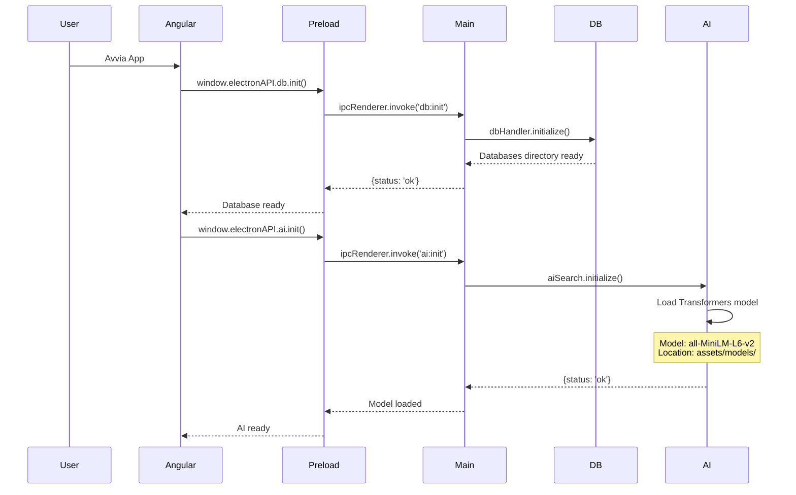
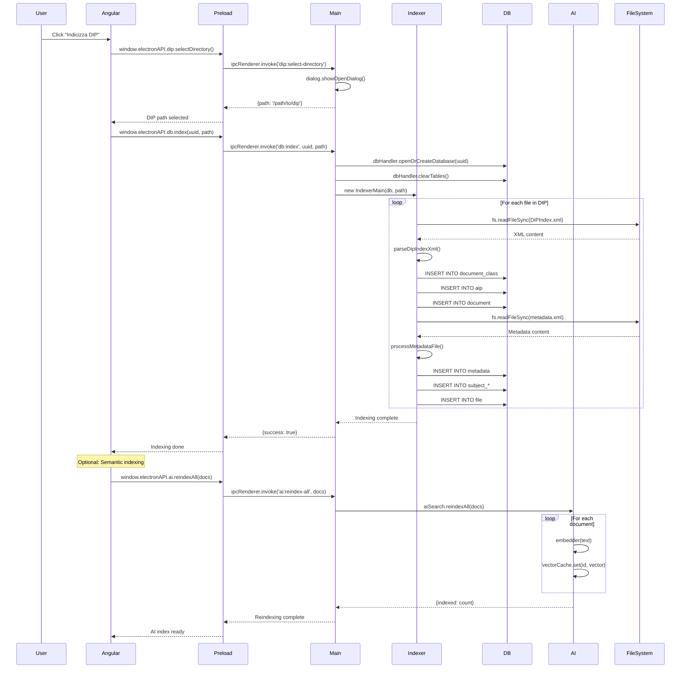
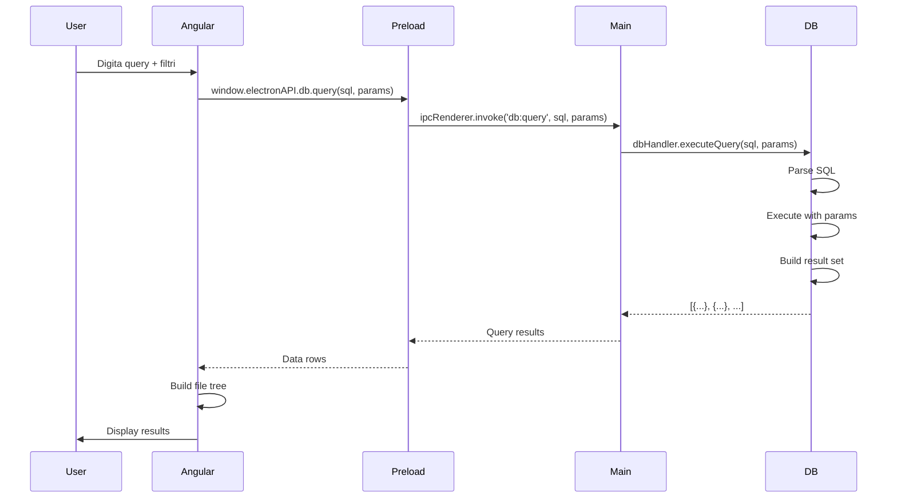
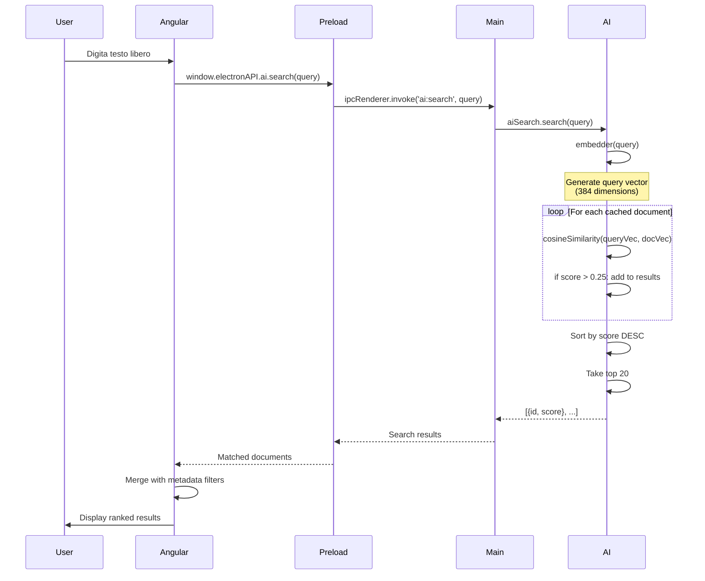
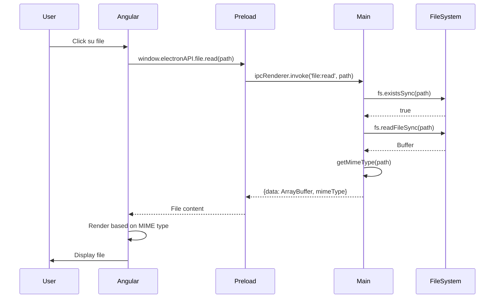

# DipReader - Architettura Completa

## Overview

DipReader è un'applicazione Electron che indicizza e gestisce archivi DIP (Documenti Informatici Persistenti) utilizzando:
- **SQLite nativo** per la persistenza dei dati
- **AI semantica** per la ricerca intelligente
- **Node.js** nel main process per operazioni I/O e database
- **Angular** nel renderer process per l'interfaccia utente

---

## Architettura a 3 Layer

```
┌─────────────────────────────────────────────────────────────────────┐
│                        ELECTRON APPLICATION                         │
├─────────────────────────────────────────────────────────────────────┤
│                                                                     │
│  ┌──────────────────────────────────────────────────────────────┐  │
│  │              LAYER 1: RENDERER PROCESS (Angular)             │  │
│  │                         Browser Context                       │  │
│  ├──────────────────────────────────────────────────────────────┤  │
│  │                                                              │  │
│  │  ┌────────────────┐  ┌────────────────┐  ┌───────────────┐ │  │
│  │  │  AppComponent  │  │ MetadataViewer │  │  SearchUI     │ │  │
│  │  └────────┬───────┘  └────────┬───────┘  └───────┬───────┘ │  │
│  │           │                   │                  │         │  │
│  │           └───────────┬───────┴──────────────────┘         │  │
│  │                       ▼                                    │  │
│  │       ┌───────────────────────────────────┐               │  │
│  │       │  database-electron.service.ts    │               │  │
│  │       │  - IPC communication layer       │               │  │
│  │       │  - Uses window.electronAPI       │               │  │
│  │       └───────────────┬───────────────────┘               │  │
│  │                       │                                    │  │
│  │       ┌───────────────▼───────────────┐                   │  │
│  │       │    search.service.ts         │                   │  │
│  │       │  - Semantic search UI logic  │                   │  │
│  │       │  - Uses window.electronAPI.ai│                   │  │
│  │       └───────────────┬───────────────┘                   │  │
│  │                       │                                    │  │
│  └───────────────────────┼────────────────────────────────────┘  │
│                          │                                        │
│  ════════════════════════╪════════════════════════════════════   │
│           IPC Bridge     │    (Secure Communication)             │
│  ════════════════════════╪════════════════════════════════════   │
│                          │                                        │
│  ┌───────────────────────▼────────────────────────────────────┐  │
│  │           LAYER 2: PRELOAD SCRIPT (Security Bridge)        │  │
│  ├─────────────────────────────────────────────────────────────┤  │
│  │                                                             │  │
│  │  preload.js                                                │  │
│  │  ┌─────────────────────────────────────────────────────┐   │  │
│  │  │ contextBridge.exposeInMainWorld('electronAPI', {   │   │  │
│  │  │                                                     │   │  │
│  │  │   db: {                                            │   │  │
│  │  │     init, open, index, query, list, delete,       │   │  │
│  │  │     export, info                                  │   │  │
│  │  │   },                                              │   │  │
│  │  │                                                     │   │  │
│  │  │   dip: {                                          │   │  │
│  │  │     selectDirectory                               │   │  │
│  │  │   },                                              │   │  │
│  │  │                                                     │   │  │
│  │  │   file: {                                         │   │  │
│  │  │     read                                          │   │  │
│  │  │   },                                              │   │  │
│  │  │                                                     │   │  │
│  │  │   ai: {                                           │   │  │
│  │  │     init, index, search, reindexAll,             │   │  │
│  │  │     generateEmbedding, state, clear              │   │  │
│  │  │   }                                               │   │  │
│  │  │ })                                                 │   │  │
│  │  └─────────────────────────────────────────────────────┘   │  │
│  │                                                             │  │
│  └─────────────────────────────────────────────────────────────┘  │
│                          │                                        │
│                          │ ipcRenderer.invoke()                   │
│                          ▼                                        │
│  ┌─────────────────────────────────────────────────────────────┐  │
│  │          LAYER 3: MAIN PROCESS (Node.js Backend)           │  │
│  │                      System Context                         │  │
│  ├─────────────────────────────────────────────────────────────┤  │
│  │                                                             │  │
│  │  main.js                                                   │  │
│  │  ┌──────────────────────────────────────────────────────┐  │  │
│  │  │              IPC Handler Registry                    │  │  │
│  │  │                                                      │  │  │
│  │  │  Database Handlers (14):                           │  │  │
│  │  │    • db:init         • db:open      • db:index     │  │  │
│  │  │    • db:query        • db:list      • db:delete    │  │  │
│  │  │    • db:export       • db:info                     │  │  │
│  │  │    • dip:select-directory • file:read             │  │  │
│  │  │                                                      │  │  │
│  │  │  AI Handlers (7):                                  │  │  │
│  │  │    • ai:init         • ai:index                    │  │  │
│  │  │    • ai:search       • ai:reindex-all             │  │  │
│  │  │    • ai:generate-embedding                         │  │  │
│  │  │    • ai:state        • ai:clear                    │  │  │
│  │  └──────────┬────────────────────────┬─────────────────┘  │  │
│  │             │                        │                    │  │
│  │             ▼                        ▼                    │  │
│  │  ┌──────────────────┐    ┌────────────────────────┐      │  │
│  │  │  db-handler.js   │    │   indexer-main.js     │      │  │
│  │  ├──────────────────┤    ├────────────────────────┤      │  │
│  │  │ better-sqlite3   │    │ XML Parsing (xmldom)  │      │  │
│  │  │                  │    │ File System (fs)      │      │  │
│  │  │ Methods:         │    │                       │      │  │
│  │  │ • openDatabase   │    │ Methods:              │      │  │
│  │  │ • executeQuery   │    │ • indexDip()          │      │  │
│  │  │ • clearTables    │    │ • parseDipIndexXml()  │      │  │
│  │  │ • exportDatabase │    │ • processMetadata()   │      │  │
│  │  │ • listDatabases  │    │ • extractSubjects()   │      │  │
│  │  └────────┬─────────┘    └────────┬───────────────┘      │  │
│  │           │                       │                       │  │
│  │           ▼                       ▼                       │  │
│  │  ┌────────────────────────────────────────────┐          │  │
│  │  │         SQLite Database (Native)           │          │  │
│  │  │  ~/.config/dip-reader/databases/           │          │  │
│  │  │                                            │          │  │
│  │  │  Tables:                                   │          │  │
│  │  │    • archival_process                      │          │  │
│  │  │    • document_class                        │          │  │
│  │  │    • aip                                   │          │  │
│  │  │    • document                              │          │  │
│  │  │    • file                                  │          │  │
│  │  │    • metadata                              │          │  │
│  │  │    • subject_*  (pf, pg, pai, pae, as, sq) │          │  │
│  │  │    • administrative_procedure              │          │  │
│  │  │    • phase                                 │          │  │
│  │  │    • document_aggregation                  │          │  │
│  │  │    • document_subject_association          │          │  │
│  │  └────────────────────────────────────────────┘          │  │
│  │                                                           │  │
│  │  ┌────────────────────────────────────────────┐          │  │
│  │  │           ai-search.js                     │          │  │
│  │  ├────────────────────────────────────────────┤          │  │
│  │  │ @xenova/transformers                      │          │  │
│  │  │ Model: all-MiniLM-L6-v2 (quantized)       │          │  │
│  │  │                                            │          │  │
│  │  │ In-Memory Vector Cache:                   │          │  │
│  │  │   Map<documentId, Float32Array>           │          │  │
│  │  │                                            │          │  │
│  │  │ Methods:                                   │          │  │
│  │  │ • initialize()          - Load AI model   │          │  │
│  │  │ • indexDocument()       - Embed text      │          │  │
│  │  │ • search()              - Find similar    │          │  │
│  │  │ • reindexAll()          - Rebuild index   │          │  │
│  │  │ • generateEmbedding()   - Get vector      │          │  │
│  │  │ • cosineSimilarity()    - Compare docs    │          │  │
│  │  └────────────────────────────────────────────┘          │  │
│  │                                                           │  │
│  └───────────────────────────────────────────────────────────┘  │
│                                                                 │
└─────────────────────────────────────────────────────────────────┘
```

---

## Flussi Operativi Principali

### 1. Inizializzazione App



### 2. Indicizzazione DIP



### 3. Ricerca Database



### 4. Ricerca Semantica



### 5. Lettura File



---

## Struttura File System

```
DipReader/
├── main.js                          # Entry point Electron
├── preload.js                       # IPC security bridge
├── db-handler.js                    # SQLite database wrapper
├── indexer-main.js                  # DIP indexing logic
├── ai-search.js                     # AI semantic search
│
├── package.json                     # Dependencies & build config
├── angular.json                     # Angular build config
│
├── public/
│   ├── schema.sql                   # Database schema
│   └── package-manifest.json        # Manifest for Electron
│
├── src/                             # Angular source
│   ├── index.html
│   ├── main.ts                      # Angular bootstrap
│   ├── styles.css
│   │
│   ├── app/
│   │   ├── app.component.ts         # Main UI component
│   │   ├── app.component.html
│   │   ├── app.config.ts
│   │   │
│   │   ├── database-electron.service.ts   # IPC DB client
│   │   ├── dip-reader.service.ts          # UI state
│   │   ├── metadata-viewer.component.ts   # Metadata display
│   │   │
│   │   ├── services/
│   │   │   ├── search.service.ts          # Semantic search UI
│   │   │   ├── metadata.service.ts        # Metadata helpers
│   │   │   └── file-integrity.service.ts  # File verification
│   │   │
│   │   └── models/
│   │       ├── search-filter.ts           # Filter types
│   │       └── integrity-check.ts         # Integrity types
│   │
│   └── assets/
│       ├── models/                        # AI model files
│       │   └── Xenova/
│       │       └── all-MiniLM-L6-v2/
│       │           ├── config.json
│       │           ├── tokenizer.json
│       │           ├── tokenizer_config.json
│       │           └── onnx/
│       │               ├── model.onnx
│       │               └── model_quantized.onnx
│       │
│       └── onnx-wasm/                     # ONNX runtime
│           └── ort-wasm-simd.wasm
│
└── dist/                                  # Build output
    └── DipReader/
        └── browser/
            ├── index.html
            ├── main-*.js
            └── assets/
```

---

## Database Schema

### Tabelle Principali

```sql
-- Processo archivistico
archival_process (uuid)

-- Classe documentale (es: Fatture, Registri IVA)
document_class (id, class_name)

-- AiP (Archival Information Package)
aip (uuid, document_class_id, archival_process_uuid, root_path)

-- Documento
document (id, root_path, aip_uuid, aggregation_id)

-- File fisico
file (id, relative_path, root_path, is_main, document_id)

-- Metadati
metadata (id, meta_key, meta_value, document_id, file_id, 
          aip_uuid, archival_process_uuid, meta_type)

-- Procedure amministrative
administrative_procedure (id, catalog_uri, title, subject_of_interest)

-- Fasi
phase (id, type, start_date, end_date, administrative_procedure_id)

-- Aggregazioni documentali
document_aggregation (id, procedure_id, type)
```

### Soggetti (6 tipi)

```sql
subject (id)  -- Tabella base

-- Persona Fisica
subject_pf (subject_id, cf, first_name, last_name, digital_addresses)

-- Persona Giuridica
subject_pg (subject_id, p_iva, company_name, office_name, digital_addresses)

-- PA Interna
subject_pai (subject_id, administration_ipa_name, administration_aoo_name, 
             administration_uor_name, digital_addresses)

-- PA Esterna
subject_pae (subject_id, administration_name, office_name, digital_addresses)

-- Assegnatario/Sistema
subject_as (subject_id, first_name, last_name, cf, 
            organization_name, office_name, digital_addresses)

-- Sistema Qualificato
subject_sq (subject_id, system_name)

-- Associazione documento-soggetto
document_subject_association (document_id, subject_id)
```

---

## Tecnologie & Dipendenze

### Main Process (Node.js)
```json
{
  "better-sqlite3": "^12.6.2",      // SQLite nativo
  "xmldom": "^0.6.0",                // XML parsing
  "@xenova/transformers": "^2.17.2", // AI inference
  "electron": "^40.2.1"              // Framework
}
```

### Renderer Process (Browser)
```json
{
  "@angular/core": "^21.0.0",        // Framework UI
  "@angular/forms": "^21.0.0",       // Forms
  "@angular/router": "^21.0.0",      // Routing
  "onnxruntime-web": "^1.24.1"       // ONNX runtime (per AI)
}
```

### Build Tools
```json
{
  "@electron/rebuild": "^4.0.3",     // Native modules rebuild
  "electron-builder": "^26.7.0",     // App packaging
  "@angular/cli": "^20.0.6"          // Angular build
}
```

---

## Performance & Ottimizzazioni

### Database
- **SQLite nativo** via better-sqlite3 (3-5x più veloce di WASM)
- **Transazioni** per operazioni batch
- **Indici** su chiavi esterne e campi ricercabili
- **Connection pooling** gestito da db-handler

### AI Search
- **Vector cache in memoria** (Map con Float32Array)
- **Model quantizzato** (~23MB vs ~80MB)
- **4 thread ONNX** in Node.js (vs 1 in browser)
- **Cosine similarity ottimizzata** (vettori normalizzati)
- **Threshold 0.25** per filtrare risultati irrilevanti
- **Top 20 results** per limitare il carico

### File I/O
- **Sincrone** per operazioni piccole e frequenti
- **Case-insensitive fallback** per compatibilità filesystem
- **Path normalization** (rimozione ./, //, ecc.)
- **MIME type detection** per rendering appropriato

### IPC Communication
- **Typed APIs** nel preload per type safety
- **Promise-based** (async/await pattern)
- **Structured data** (no serializzazione custom)
- **Error propagation** trasparente

---

## Security Model

### IPC Isolation
```javascript
// preload.js - Context Bridge
contextBridge.exposeInMainWorld('electronAPI', {
  // ✅ API controllate e sicure
  // ❌ NO accesso diretto a require() o node APIs
})
```

### Renderer Process
- **No Node.js integration** (`nodeIntegration: false`)
- **Context isolation** (`contextIsolation: true`)
- **Preload script** per API whitelisting
- **CSP headers** per XSS protection

### File System Access
- **Validazione path** in main process
- **Dialog nativo** per selezione directory
- **Sandboxing** renderer process
- **fs.existsSync** check prima di ogni lettura

---

## Packaging & Distribution

### Development
```bash
npm run electron  # ng build + electron .
```

### Production Build
```bash
npm run dist      # ng build --prod + electron-builder
```

### Output Structure
```
dist-electron/
├── DipReader-0.0.0.AppImage         # Linux
├── win-unpacked/                    # Windows portable
│   ├── DipReader.exe
│   └── resources/
│       ├── app.asar                 # App bundle
│       └── assets/
│           ├── models/              # AI models
│           └── onnx-wasm/
└── linux-unpacked/
    ├── dip-reader
    └── resources/
```

### extraResources
Model AI e ONNX WASM copiati fuori da `app.asar`:
- `resources/assets/models/`
- `resources/assets/onnx-wasm/`

Percorsi risolti dinamicamente:
```javascript
const modelsPath = app.isPackaged 
  ? path.join(process.resourcesPath, 'assets', 'models')
  : path.join(__dirname, 'dist', 'DipReader', 'browser', 'assets', 'models');
```

---

## Estensioni Future

### Possibili Miglioramenti

1. **SQLite Vector Extension (vec0)**
   - Persistenza vettori su disco
   - Similarity search nativo SQL
   - SIMD accelerato

2. **Incremental Indexing**
   - Watch file system per cambiamenti
   - Delta updates invece di full reindex
   - Background indexing durante idle

3. **Advanced Search**
   - Hybrid search (semantic + SQL)
   - Re-ranking algorithms
   - User feedback learning

4. **Collaboration**
   - Multi-user database sync
   - Conflict resolution
   - Access control

5. **Export/Import**
   - CSV export
   - JSON backup
   - Migration tools

---

## Troubleshooting

### AI Model non carica
```bash
# Verifica path
console.log('[AI Search] Models path:', modelsPath)

# Controlla esistenza file
ls -la src/assets/models/Xenova/all-MiniLM-L6-v2/
# Deve contenere: config.json, tokenizer.json, onnx/model_quantized.onnx
```

### Database lock
```bash
# Chiudi tutte le connessioni
rm ~/.config/dip-reader/databases/*.db-wal
rm ~/.config/dip-reader/databases/*.db-shm
```

### IPC timeout
```javascript
// Aumenta timeout in main.js
ipcMain.handle('ai:reindex-all', async (event, docs) => {
  // Heavy operation, no timeout needed
})
```

### Build errors
```bash
# Rebuild native modules
npx electron-rebuild -f

# Clean build
rm -rf dist/ dist-electron/ .angular/
npm run electron
```

---

## Metriche di Performance

### Tempi Medi (su sistema mid-range)

| Operazione | Tempo | Note |
|------------|-------|------|
| Init Database | ~100ms | Prima apertura |
| Index DIP (1000 docs) | ~5-10s | Dipende da complessità XML |
| AI Model Load | ~2-3s | Una tantum all'avvio |
| AI Index (1 doc) | ~50-100ms | Per documento |
| Semantic Search | ~100-200ms | Con 1000 docs in cache |
| SQL Query | ~10-50ms | Dipende da complessità |
| File Read | ~5-20ms | Dipende da dimensione |

### Memoria

| Componente | Utilizzo |
|------------|----------|
| Main Process | ~150-200 MB |
| Renderer Process | ~100-150 MB |
| AI Model | ~25 MB |
| Vector Cache (1000 docs) | ~1.5 MB |
| SQLite Database | ~variabile |

---

## Conclusioni

DipReader utilizza un'**architettura ibrida** che combina:
- ✅ **Performance native** (SQLite, Node.js, 4 threads AI)
- ✅ **UI moderna** (Angular, TypeScript)
- ✅ **Security** (IPC isolation, context bridge)
- ✅ **AI avanzata** (transformers.js, semantic search)

Tutti i componenti comunicano via **IPC sicuro** mantenendo separazione tra:
- **System operations** (main process)
- **User interface** (renderer process)

Il risultato è un'applicazione **scalabile**, **sicura** e **performante** per la gestione di archivi documentali complessi.
